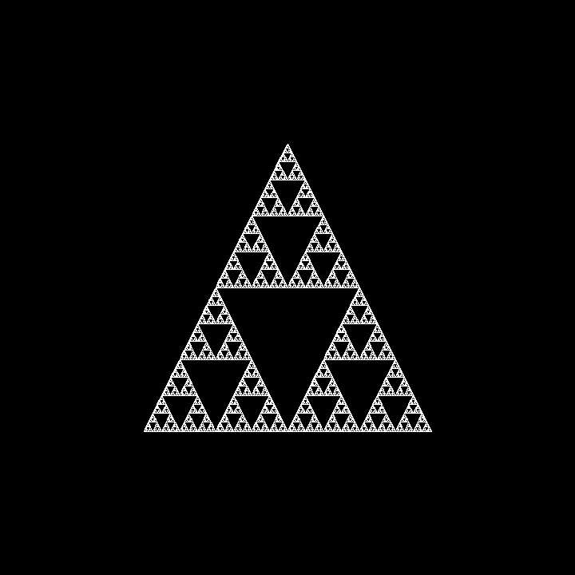

# Le Triangle de Sierpiński

## 🥶 About 
Hi, this is a code that reproduces the famous Sierpiński Triangle

## 🧰 Installation 
You must have the following dependencies :
- `pygame`
## 📌 Credits 
The creator is `kyrokx` (On discord)

The licence is [MIT](LICENCE)

Server discord [Link](https://discord.gg/qYbPgM4GgF)

## 💌 Thanks 

_**Thank you for being interested in my project. Leave me a star to support me THANKS INFINITELY**_